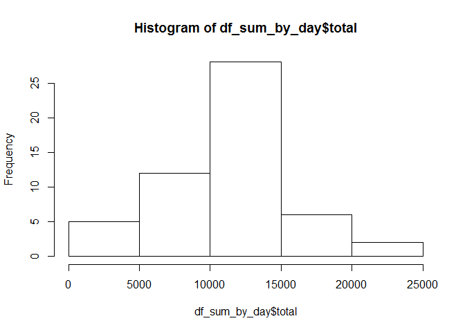
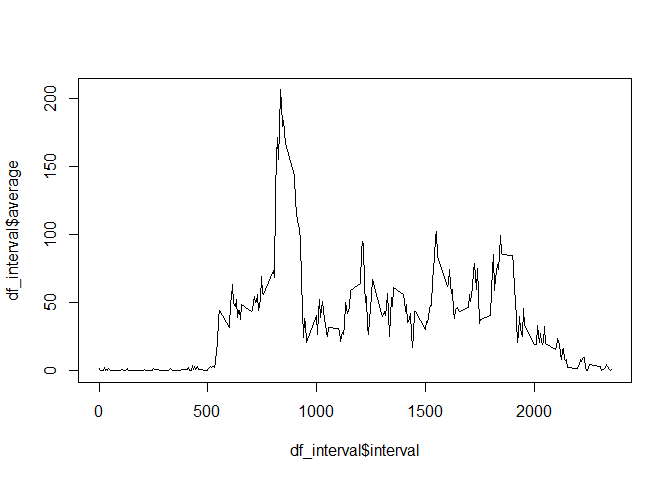
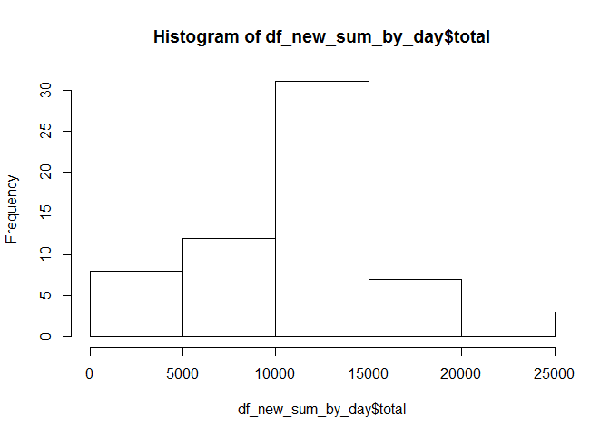
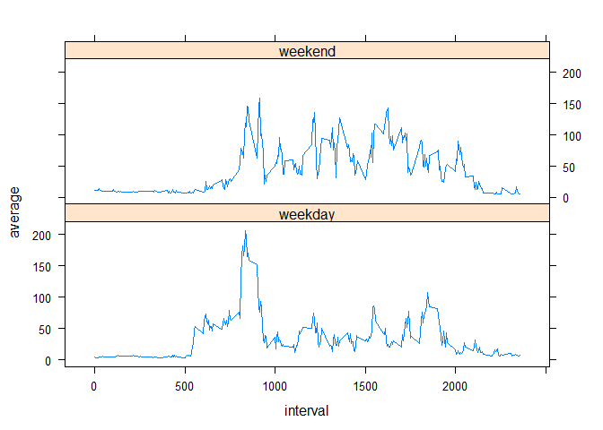

# Reproducible Research: Peer Assessment 1


## Loading and preprocessing the data
The following code loads the necessary libraries and tests if the activity.csv file is available.
It is assumed that the currenct directory contains at least the activity.zip file or we have to change the
working directory accordingly. 

```r
suppressMessages(library(dplyr))
suppressMessages(library(lattice))
if (!file.exists("activity.zip")) setwd('C:/POC/Git/RepData_PeerAssessment1') #setting according to user environment
if (!file.exists("activity.csv")) unzip('activity.zip')
```

The *df0* data frame has the original data loaded and the *df* data frame has the transformed data with Dates in R format.

```r
df0 <- read.csv('activity.csv')

df <- df0 %>%
  mutate(date=as.Date(date, "%Y-%m-%d"))
```

## What is mean total number of steps taken per day?

As we can ignore missing values in dataset, we can create a data frame with complete cases. 
Then we can summarise the total number of steps taken each day. 

```r
df_complete_cases <- df[complete.cases(df),]

df_sum_by_day <- df_complete_cases %>%
  group_by(date) %>%
  summarise(total=sum(steps))
```

Following the histogram of the total number of steps taken each day

```r
hist(df_sum_by_day$total)
```

<!-- -->

It is interesting to calculate the mean and median total number of steps taken per day

```r
mean_total_per_day <- mean(df_sum_by_day$total)
print(mean_total_per_day)
```

```
## [1] 10766.19
```

```r
median_total_per_day <- median(df_sum_by_day$total)
print(median_total_per_day)
```

```
## [1] 10765
```

The computed mean total number of steps taken per day is approximatly 10766 and computed median total number of steps taken per day is 10765.

## What is the average daily activity pattern?

We can plot the the average number of steps taken averaged across all days for each interval


```r
df_interval <- df_complete_cases %>%
  group_by(interval) %>%
  summarise(average=mean(steps))

plot(x=df_interval$interval, y=df_interval$average, type='l')
```

<!-- -->

And we calculate which 5-minute interval, on average across all the days in the dataset, contains the maximum number of steps

```r
interval_max = df_interval$interval[which.max(df_interval$average)]
print(interval_max)
```

```
## [1] 835
```
So it is around 08:35 AM that we see major activity.

## Imputing missing values

We can calculate the total number of missing values in the dataset (i.e. the total number of rows with NAs)


```r
df_rows_NA <- df[!complete.cases(df),]
nrow_NA <- nrow(df_rows_NA)
print(nrow_NA)
```

```
## [1] 2304
```
So the total number of missing values is 2304

The strategy to fill the missing values will be to complete with the mean for that 5-minute interval.
The *df_interval* already contains what we need. We just need to merge with incomplete subset.


```r
df_incomplete <- df[!complete.cases(df),]
df_merge <- merge(df_incomplete, df_interval)
```

we can create new dataset that is equal to the original dataset but with the missing data filled in.

```r
df_new <- df
df_new[!complete.cases(df_new),c('steps')] <-df_merge[,c('average')]
```
Make a histogram of the total number of steps taken each day and Calculate and report the mean and median total number of steps taken per day. Do these values differ from the estimates from the first part of the assignment? What is the impact of imputing missing data on the estimates of the total daily number of steps?

Following the histogram with the new data frame

```r
df_new_sum_by_day <- df_new %>%
  group_by(date) %>%
  summarise(total=sum(steps))

hist(df_new_sum_by_day$total)
```

<!-- -->

Let's check the impact of imputing missing data on the estimates of the total daily number of steps.


```r
new_mean_total_per_day <- mean(df_new_sum_by_day$total)
print(new_mean_total_per_day)
```

```
## [1] 10766.19
```

```r
new_median_total_per_day <- median(df_new_sum_by_day$total)
print(new_median_total_per_day)
```

```
## [1] 11015
```

The calculated difference in mean *(new_mean_total_per_day - mean_total_per_day)* is 0. It is zero because 
we used the mean to replace the missing values.
The difference in median *(new_median_total_per_day - median_total_per_day)* is 250.

## Are there differences in activity patterns between weekdays and weekends?

To answer this question, let's create the function *fun_day_type* to return if the day is *weekday* or *weekend*.
Then we can use this function to add a new column *daytype* in data frame


```r
fun_day_type <- function(x) {
  x <-  as.Date(x)
  day_type <- 'weekday'
  if ( (weekdays(x) == 'Saturday') | (weekdays(x)=='Sunday') ) day_type='weekend'
  day_type
}

df_new$daytype <- apply(df_new, 1, function(x) { fun_day_type(x[2]) } )
```

In order to compare the weekdays and weekends, we can average grouping by *daytype*.


```r
df_comp <- df_new %>% 
  group_by(daytype,interval) %>%
  summarise(average=mean(steps))
  
xyplot(average~interval|daytype, data=df_comp, type='l',layout=(c(1,2)))
```

<!-- -->

By looking at the chart, we can see difference in pattern.
